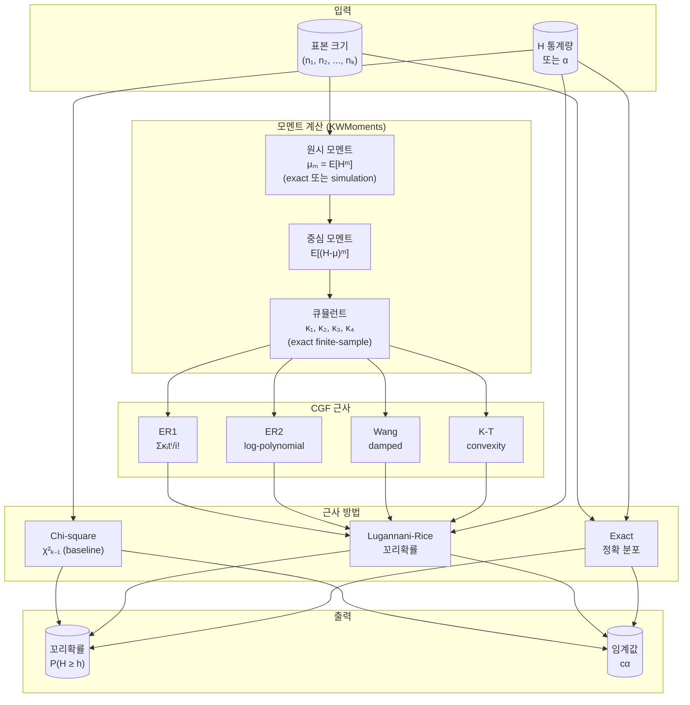
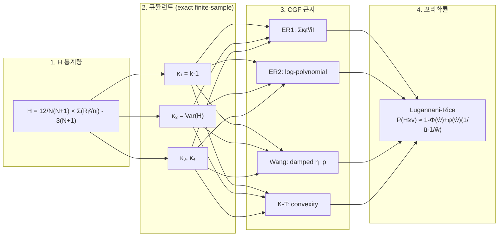
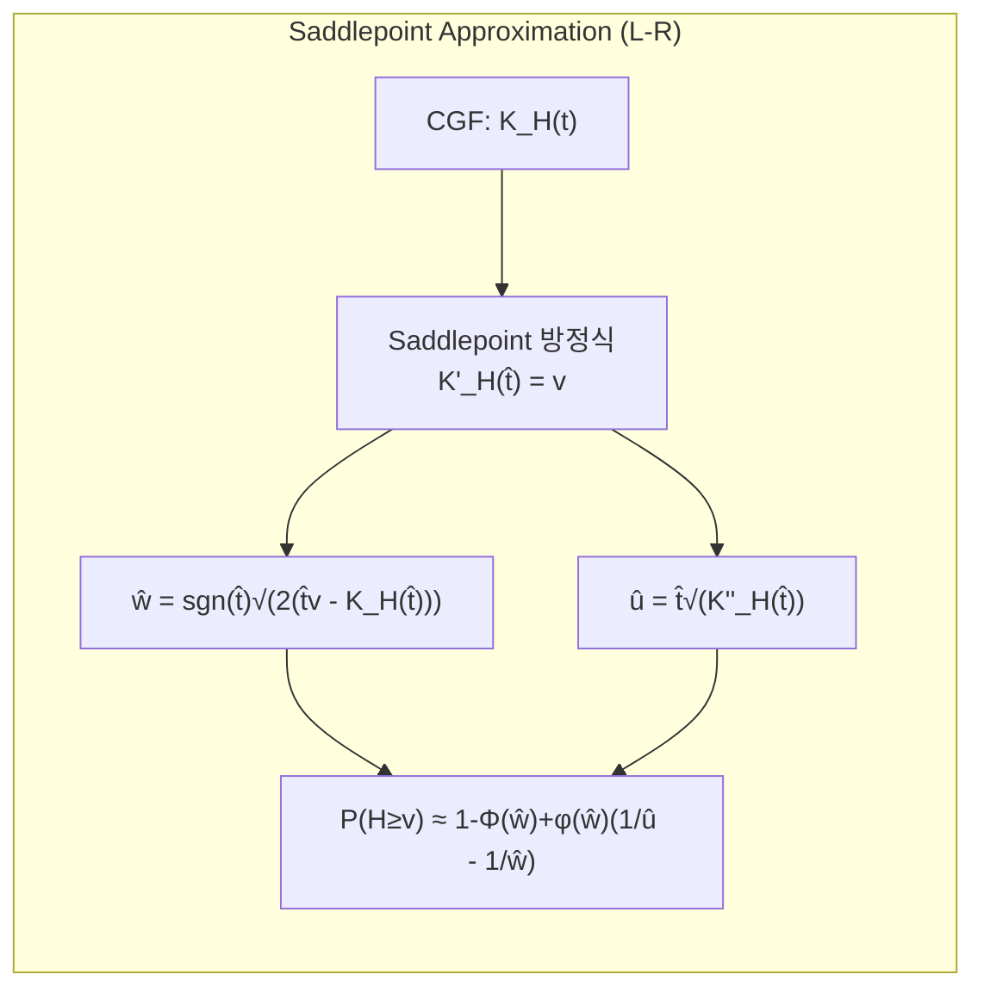
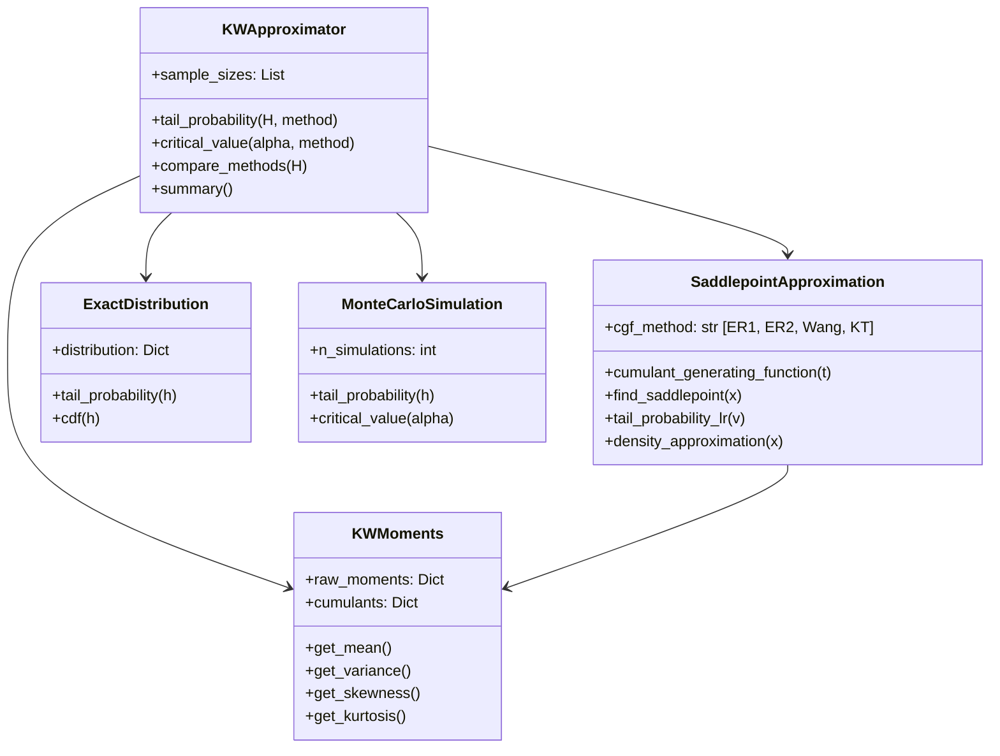

# kw-approx: Higher Order Asymptotic Approximations for Kruskal-Wallis Statistics

Kruskal-Wallis 검정 통계량의 고차 새들포인트 근사를 구현한 Python 패키지입니다.

## 논문 정보

이 패키지는 다음 논문의 방법론을 구현합니다:

> **Murakami, H., Lee, J.-S., & Ha, H.-T. (2026).** *Higher Order Asymptotic Approximations of Kruskal-Wallis Statistics Based on Skewness and Kurtosis.* Preprint submitted to Mathematics.

## 배경

Kruskal-Wallis 검정은 k개 집단의 중앙값(또는 평균) 동일성을 검정하는 비모수적 방법으로, 일원분산분석(One-way ANOVA)의 순위 기반 대안입니다.

### Kruskal-Wallis H 통계량

$$H = \frac{12}{N(N+1)} \sum_{i=1}^{k} \frac{R_i^2}{n_i} - 3(N+1)$$

- $N = \sum_{i=1}^{k} n_i$: 전체 표본 크기
- $n_i$: $i$번째 집단의 표본 크기
- $R_i$: $i$번째 집단의 순위합

전통적으로 $H$의 귀무분포는 자유도 $k-1$인 카이제곱 분포로 근사하지만, 소표본에서는 정확도가 떨어집니다. 이 패키지는 4가지 CGF 근사(ER1, ER2, Wang, K-T)와 Lugannani-Rice 꼬리확률을 사용하여 더 정확한 근사를 제공합니다.

## 설치

```bash
pip install numpy scipy
pip install -e .
```

## 빠른 시작

```python
from kw_approx import KWApproximator

# 3개 집단, 각 3명씩
approx = KWApproximator([3, 3, 3])

# H = 4.62에서 꼬리확률 P(H >= 4.62)
p_value = approx.tail_probability(4.62, method='ER1')
print(f"ER1 P-value: {p_value:.6f}")

# 여러 방법 비교
results = approx.compare_methods(4.62)
for method, p in results.items():
    print(f"{method}: {p:.6f}")
```

## 계산 흐름도 (Algorithm Flow)



## 수식 전개 흐름도 (Formula Flow)



## 근사 방법별 수식 흐름



## 구현된 근사 방법

### 큐뮬런트 (Cumulants) — Exact Finite-Sample

논문 Section 4에 따라, 모든 CGF 방법은 **정확한 유한표본 큐뮬런트**를 사용합니다:

- 소표본 (N ≤ 15): exact distribution으로 계산
- 대표본 (N > 15): Monte Carlo simulation으로 추정

> **참고:** 논문 Section 2.4.2의 asymptotic χ² 큐뮬런트는 소표본에서 큰 오차를 보이므로 사용하지 않습니다 (예: (3,3,3)에서 κ₂: exact 2.72 vs asymptotic 4.0, κ₄: exact 0.11 vs asymptotic 96.0).

### Saddlepoint Approximation — Lugannani-Rice

Daniels (1954)의 새들포인트 밀도 근사:

$$f_{SP}(x) = \left(2\pi K_H^{(2)}(\hat{t})\right)^{-1/2} \exp(K_H(\hat{t}) - x\hat{t})$$

**Lugannani-Rice 꼬리확률 근사:**

$$\Pr(H \geq v) \approx 1 - \Phi(\hat{w}) + \phi(\hat{w})\left(\frac{1}{\hat{u}} - \frac{1}{\hat{w}}\right)$$

여기서:
- $\hat{w} = \text{sgn}(\hat{t})\sqrt{2(\hat{t}v - K_H(\hat{t}))}$
- $\hat{u} = \hat{t}\sqrt{K_H^{(2)}(\hat{t})}$

### CGF (Cumulant Generating Function) 근사 방법

**ER1 (Easton-Ronchetti 1st approximation):**
$$K_H(t) \approx \sum_{i=1}^{4} \frac{\kappa_i t^i}{i!} = \kappa_1 t + \frac{\kappa_2}{2}t^2 + \frac{\kappa_3}{6}t^3 + \frac{\kappa_4}{24}t^4$$

**ER2 (Easton-Ronchetti 2nd approximation):**
$$K_H(t) \approx \kappa_1 t + \frac{\kappa_2}{2}t^2 + \log\left(1 + \frac{\kappa_3}{6}t^3 + \frac{3\kappa_4}{72}t^4 + \frac{\kappa_3^2}{72}t^6\right)$$

**Wang (damped approximation):**
$$K_H(t) \approx \kappa_1 t + \frac{\kappa_2}{2}t^2 + \left(\frac{\kappa_3}{6}t^3 + \frac{\kappa_4}{24}t^4\right)\eta_p(t)$$

여기서 $\eta_p(t) = \exp(-\kappa_2 p^2 t^2 / 2)$이고, $p$는 $K''_W(t;p) \geq 0$을 보장하는 최소 damping parameter.

**K-T (Kakizawa-Taniguchi correction):**
$$K_H(t) \approx \kappa_1 t + \frac{(1+\kappa_2)}{2}t^2 + \frac{\kappa_3}{6}t^3 + \frac{\kappa_4}{24}t^4$$

### 연속성 보정 (Continuity Correction)

이산 분포의 특성을 보정하기 위해 $v$를 $v - 1/2$로 대체하여 `ER1_cc`, `ER2_cc`, `Wang_cc`, `KT_cc` 계산.

### Exact Distribution

Iman et al. (1975)의 재귀 알고리즘을 사용한 정확 분포 계산입니다. 소표본(N ≤ 15)에서만 실용적입니다.

### Monte Carlo Simulation

정확 분포 계산이 불가능한 대표본에서 귀무분포를 시뮬레이션합니다:

```python
from kw_approx import MonteCarloSimulation

sim = MonteCarloSimulation([5, 5, 5], n_simulations=10000, seed=42)
p = sim.tail_probability(4.5)
```

## 모멘트와 큐뮬런트

귀무가설 하에서 H 통계량의 기본 모멘트:

- **평균**: $E(H) = k - 1$
- **분산**: Wallace (1959) exact formula:

$$\text{Var}(H) = 2(k-1) - \frac{2}{5}\frac{A}{N(N+1)} - \frac{6}{5}\sum_{i=1}^{k}\frac{1}{n_i}$$

여기서 $A = 3k(k-2) + N(2k^2 - 6k + 1)$.

**큐뮬런트** (Cumulants) — exact finite-sample:
- $\kappa_1 = E(H) = k - 1$
- $\kappa_2 = \text{Var}(H)$
- $\kappa_3 = \mu_3$ (third central moment)
- $\kappa_4 = \mu_4 - 3\sigma^4$ (excess kurtosis $\times \sigma^4$)

## 사용 가능한 방법들

| 코드명 | 설명 | CGF | 꼬리확률 |
|--------|------|-----|---------|
| `chi_square` | 카이제곱 근사 (baseline) | — | χ²(k-1) SF |
| `ER1` | Easton-Ronchetti 1st | polynomial | Lugannani-Rice |
| `ER2` | Easton-Ronchetti 2nd | log-polynomial | Lugannani-Rice |
| `Wang` | Wang damped | damped exponential | Lugannani-Rice |
| `KT` | Kakizawa-Taniguchi | convexity-enhanced | Lugannani-Rice |
| `ER1_cc` | ER1 + 연속성 보정 | polynomial | Lugannani-Rice |
| `ER2_cc` | ER2 + 연속성 보정 | log-polynomial | Lugannani-Rice |
| `Wang_cc` | Wang + 연속성 보정 | damped exponential | Lugannani-Rice |
| `KT_cc` | K-T + 연속성 보정 | convexity-enhanced | Lugannani-Rice |
| `exact` | 정확 분포 (소표본) | — | — |
| `simulation` | Monte Carlo 시뮬레이션 | — | — |

## 패키지 구조



### 파일 구조

```
kw_approx/
├── __init__.py           # 패키지 초기화 (v0.3.0)
├── kruskal_wallis.py     # H 통계량 계산
├── moments.py            # 모멘트/큐뮬런트 계산 (exact/simulation)
├── saddlepoint.py        # 새들포인트 근사 (ER1, ER2, Wang, KT + L-R)
├── exact.py              # 정확 분포 (소표본)
├── simulation.py         # Monte Carlo 시뮬레이션
└── approximator.py       # 통합 인터페이스

examples/
└── reproduce_paper_tables.py  # 논문 테이블 재현

tests/
└── test_approximations.py     # 테스트 케이스
```

## 상세 사용법

### 개별 근사 클래스 사용

```python
from kw_approx import SaddlepointApproximation, ExactDistribution, MonteCarloSimulation

sample_sizes = [3, 3, 3]

# Saddlepoint with different CGF methods
sp_er1 = SaddlepointApproximation(sample_sizes, cgf_method='ER1')
sp_er2 = SaddlepointApproximation(sample_sizes, cgf_method='ER2')
sp_wang = SaddlepointApproximation(sample_sizes, cgf_method='Wang')
sp_kt = SaddlepointApproximation(sample_sizes, cgf_method='KT')

print(f"ER1:  {sp_er1.tail_probability_lr(4.62):.6f}")
print(f"ER2:  {sp_er2.tail_probability_lr(4.62):.6f}")
print(f"Wang: {sp_wang.tail_probability_lr(4.62):.6f}")
print(f"KT:   {sp_kt.tail_probability_lr(4.62):.6f}")

# Exact (소표본에서만)
exact = ExactDistribution(sample_sizes)
print(f"Exact: {exact.tail_probability(4.62):.6f}")

# Monte Carlo Simulation (대표본에서)
sim = MonteCarloSimulation(sample_sizes, n_simulations=10000, seed=42)
print(f"Simulation: {sim.tail_probability(4.62):.6f}")
```

### 임계값 계산

```python
from kw_approx import KWApproximator

approx = KWApproximator([5, 5, 5])

# 유의수준 0.10에서 임계값
cv = approx.critical_value(0.10, method='ER1')
print(f"Critical value (alpha=0.10): {cv:.4f}")

# 여러 유의수준 비교
for alpha in [0.10, 0.05, 0.01]:
    cv_exact = approx.critical_value(alpha, method='exact')
    cv_chi2 = approx.critical_value(alpha, method='chi_square')
    cv_er1 = approx.critical_value(alpha, method='ER1')
    print(f"alpha={alpha}: Exact={cv_exact:.4f}, Chi2={cv_chi2:.4f}, ER1={cv_er1:.4f}")
```

### 실제 데이터에 적용

```python
import numpy as np
from scipy import stats
from kw_approx import KWApproximator

# 데이터 생성
np.random.seed(42)
group1 = np.random.normal(10, 2, 5)
group2 = np.random.normal(12, 2, 5)
group3 = np.random.normal(11, 2, 5)

# SciPy로 H 통계량 계산
result = stats.kruskal(group1, group2, group3)
H = result.statistic

# 다양한 방법으로 p-value 계산
approx = KWApproximator([5, 5, 5])

print(f"H statistic: {H:.4f}")
print(f"SciPy p-value: {result.pvalue:.4f}")

for method in ['exact', 'chi_square', 'ER1', 'ER2', 'Wang', 'KT']:
    p = approx.tail_probability(H, method)
    print(f"{method}: {p:.4f}")
```

## 방법별 권장 사용 상황

| 표본 크기 (N) | 그룹 수 (k) | 권장 방법 | 비고 |
|--------------|-------------|----------|------|
| N ≤ 15 | k ≤ 3 | `exact` | 정확 분포 계산 가능 |
| N ≤ 13 | k = 4 | `exact` | 정확 분포 계산 가능 |
| N > 15 | any | `ER1` | Lugannani-Rice 새들포인트 |
| any | any | `simulation` | Monte Carlo 참조값 |

## 테스트

```bash
# 전체 테스트 실행
python -m pytest tests/test_approximations.py -v
```

## 의존성

- Python >= 3.8
- NumPy
- SciPy

## 참고문헌

1. Kruskal, W. H. & Wallis, A. (1952). Use of ranks in one-criterion variance analysis. *JASA*, 47, 583-621.
2. Iman, R. L., Quade, D., & Alexander, D. A. (1975). Exact probability levels for the Kruskal-Wallis test.
3. Daniels, H. E. (1954). Saddlepoint approximations in statistics. *Annals of Mathematical Statistics*, 25, 631-650.
4. Lugannani, R. & Rice, S. O. (1980). Saddlepoint approximation for the distribution of the sum of independent random variables. *Advances in Applied Probability*, 12, 475-490.
5. Easton, G. S. & Ronchetti, E. (1986). General saddlepoint approximations with applications to L statistics. *JASA*, 81, 420-430.
6. Wang, S. (1992). General saddlepoint approximations in the bootstrap. *Statistics & Probability Letters*, 13, 61-66.
7. Kakizawa, Y. & Taniguchi, M. (1994). Higher order asymptotic theory for discriminant analysis. *Science Reports of the Hirosaki University*, 41, 191-199.
8. Wallace, D. L. (1959). Simplified beta-approximations to the Kruskal-Wallis H test. *JASA*, 54, 225-230.

## 라이선스

MIT License
