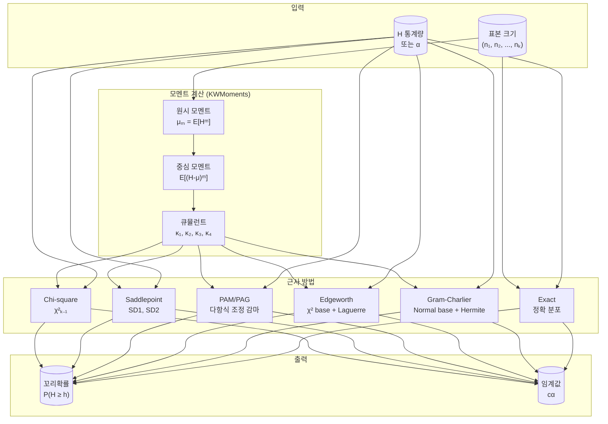
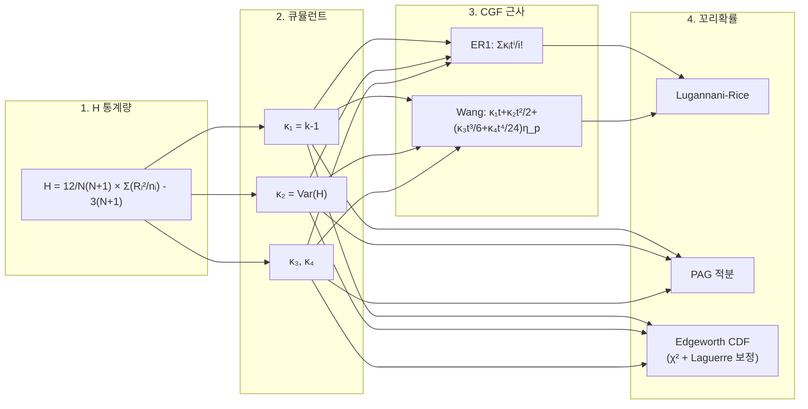
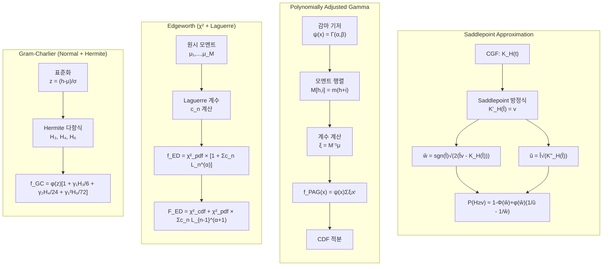
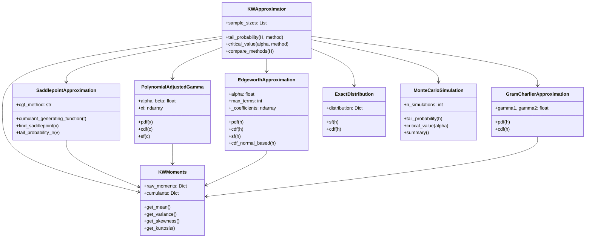

# kw-approx: Higher Order Asymptotic Approximations for Kruskal-Wallis Statistics

Kruskal-Wallis 검정 통계량의 고차 점근 근사를 구현한 Python 패키지입니다.

## 논문 정보

이 패키지는 다음 논문의 방법론을 구현합니다:

> **Murakami, H., Lee, J.-S., & Ha, H.-T. (2026).** *Higher Order Asymptotic Approximations of Kruskal-Wallis Statistics Based on Skewness and Kurtosis.* Preprint submitted to Mathematics.

## 배경

Kruskal-Wallis 검정은 k개 집단의 중앙값(또는 평균) 동일성을 검정하는 비모수적 방법으로, 일원분산분석(One-way ANOVA)의 순위 기반 대안입니다.

### Kruskal-Wallis H 통계량

$$H = \frac{12}{N(N+1)} \sum_{i=1}^{k} \frac{R_i^2}{n_i} - 3(N+1)$$

- $N = \sum_{i=1}^{k} n_i$: 전체 표본 크기
- $n_i$: $i$번째 집단의 표본 크기
- $R_i$: $i$번째 집단의 순위합

전통적으로 $H$의 귀무분포는 자유도 $k-1$인 카이제곱 분포로 근사하지만, 소표본에서는 정확도가 떨어집니다. 이 패키지는 더 정확한 고차 점근 근사 방법들을 제공합니다.

## 설치

```bash
pip install numpy scipy
pip install -e .
```

## 빠른 시작

```python
from kw_approx import KWApproximator

# 3개 집단, 각 3명씩
approx = KWApproximator([3, 3, 3])

# H = 4.62에서 꼬리확률 P(H >= 4.62)
p_value = approx.tail_probability(4.62, method='exact')
print(f"Exact P-value: {p_value:.6f}")

# 여러 방법 비교
results = approx.compare_methods(4.62)
for method, p in results.items():
    print(f"{method}: {p:.6f}")
```

## 계산 흐름도 (Algorithm Flow)



## 수식 전개 흐름도 (Formula Flow)



## 근사 방법별 수식 흐름



## 구현된 근사 방법

### 1. Polynomially Adjusted Gamma (PAM/PAG)

Ha and Provost (2007), Provost et al. (2009)의 반모수적 밀도 근사법입니다.

감마 분포를 기저 분포로 사용하고, 다항식 조정을 통해 정확도를 높입니다:

$$f_H(x; d) = \psi(x) \sum_{i=0}^{d} \xi_i x^i$$

여기서 $\psi(x)$는 감마 기저 밀도입니다.

### 2. Saddlepoint Approximation (SD1, SD2, SDC1, SDC2)

Daniels (1954)의 새들포인트 밀도 근사:

$$f_{SP}(x) = \left(2\pi K_H^{(2)}(\hat{t})\right)^{-1/2} \exp(K_H(\hat{t}) - x\hat{t})$$

**Lugannani-Rice 꼬리확률 근사:**

$$\Pr(H \geq v) \approx 1 - \Phi(\hat{w}) + \phi(\hat{w})\left(\frac{1}{\hat{u}} - \frac{1}{\hat{w}}\right)$$

여기서:
- $\hat{w} = \text{sgn}(\hat{t})\sqrt{2(\hat{t}v - K_H(\hat{t}))}$
- $\hat{u} = \hat{t}\sqrt{K_H^{(2)}(\hat{t})}$

**CGF (Cumulant Generating Function) 근사:**

**ER1 (Easton-Ronchetti 1) — SD1에 사용:**
$$K_H(t) \approx \sum_{i=1}^{4} \frac{\kappa_i t^i}{i!}$$

**Wang (KW) — SD2에 사용:**
$$K_H(t) \approx \kappa_1 t + \frac{\kappa_2}{2}t^2 + \left(\frac{\kappa_3}{6}t^3 + \frac{\kappa_4}{24}t^4\right)\eta_p(t)$$

여기서 $\eta_p(t) = \exp(-\kappa_2 p^2 t^2 / 2)$

**연속성 보정 (Continuity Correction):**
이산 분포의 특성을 보정하기 위해 $v$를 $v - 1/2$로 대체하여 SDC1, SDC2 계산

### 3. Edgeworth Expansion (ED) — Chi-square base + Laguerre 다항식

논문 Section 3.3에 따라, H 통계량이 카이제곱과 유사하므로 **카이제곱 분포를 기저**로 하고 **일반화 Laguerre 다항식**으로 보정하는 전개를 사용합니다:

**밀도 (PDF):**
$$f_{ED}(h) = f_{\chi^2}(h; p) \left[1 + \sum_{n=1}^{M} c_n L_n^{(\alpha)}(h/2)\right]$$

**누적분포 (CDF):**
$$F_{ED}(h) = F_{\chi^2}(h; p) + f_{\chi^2}(h; p) \sum_{n=1}^{M} c_n L_{n-1}^{(\alpha+1)}(h/2)$$

여기서:
- $p = k-1$ (자유도), $\alpha = p/2 - 1$ (Laguerre 파라미터)
- $L_n^{(\alpha)}(x)$: 일반화 Laguerre 다항식 (3-term recurrence로 계산)
- $c_n = \frac{n!}{\Gamma(n+\alpha+1)} \sum_{j=0}^{n} a_{n,j} \cdot \mu'_j$: 원시 모멘트로부터 계산되는 계수
- $\mu'_j = E[H^j] / 2^j$: 스케일된 원시 모멘트
- $M = 4$ (4차 절단)

이 방법은 GC-A와 달리 카이제곱 기저를 사용하므로 서로 다른 결과를 반환합니다.

### 4. Gram-Charlier Series (GC-A) — Normal base + Hermite 다항식

정규분포를 기저로 한 급수 전개:

$$f_{GC}(h) \approx \phi\left(\frac{h-\mu}{\sigma}\right)\left[1 + \frac{\gamma_1}{6}H_3(z) + \frac{\gamma_2}{24}H_4(z) + \frac{\gamma_1^2}{72}H_6(z)\right]$$

### 5. Exact Distribution

Iman et al. (1975)의 재귀 알고리즘을 사용한 정확 분포 계산입니다. 소표본(N ≤ 15)에서만 실용적입니다.

### 6. Monte Carlo Simulation

정확 분포 계산이 불가능한 대표본에서 귀무분포를 시뮬레이션합니다:

```python
from kw_approx import MonteCarloSimulation

# 10,000회 시뮬레이션
sim = MonteCarloSimulation([5, 5, 5], n_simulations=10000, seed=42)

# 꼬리확률 추정
p = sim.tail_probability(4.5)

# 임계값 추정
cv, actual_alpha = sim.critical_value(0.10)
```

## 논문 테이블 비교 결과

아래는 논문의 Table 4.1, 4.5 (10% 유의수준 근처)와 코드 결과의 비교입니다.

### Table 4.1: (3,3,3) H=4.62222

| Method | Code | Paper | RelErr | 판정 |
|--------|------|-------|--------|------|
| CHI | 0.0992 | 0.0992 | 0.0% | 완벽 |
| SD1 | 0.0755 | 0.0843 | 10.4% | 보통 |
| SD2 (Wang) | 0.0796 | 0.0789 | 0.8% | 완벽 |
| SDC1 | 0.1142 | 0.1245 | 8.3% | 보통 |
| SDC2 | 0.1195 | 0.1219 | 1.9% | 우수 |
| PAG(4) | 0.0933 | 0.0981 | 4.9% | 우수 |
| PAG(6) | 0.0882 | 0.0934 | 5.5% | 보통 |
| GC-A | 0.0742 | 0.3974 | — | 차이* |
| **ED** | **0.0934** | **0.0900** | **3.7%** | **우수** |
| Exact | 0.1000 | 0.1000 | 0.0% | 완벽 |

### Table 4.5: (3,2,2,5) H=5.587179

| Method | Code | Paper | RelErr | 판정 |
|--------|------|-------|--------|------|
| CHI | 0.1335 | 0.1335 | 0.0% | 완벽 |
| SD1 | 0.1054 | 0.1054 | 0.0% | 완벽 |
| SD2 (Wang) | 0.1102 | 0.1128 | 2.3% | 우수 |
| SDC1 | 0.1495 | 0.1483 | 0.8% | 완벽 |
| SDC2 | 0.1548 | 0.1603 | 3.4% | 우수 |
| PAG(4) | 0.1224 | 0.1094 | 11.9% | 보통 |
| PAG(6) | 0.1114 | 0.1081 | 3.1% | 우수 |
| GC-A | 0.1091 | 0.1733 | — | 차이* |
| **ED** | **0.1256** | **0.1123** | **11.9%** | **보통** |
| Exact | 0.1136 | 0.1136 | 0.0% | 완벽 |

> \* GC-A 차이는 논문이 "clearly unsatisfactory"로 평가한 방법이며, 논문이 사용한 exact cumulant 공식과 코드의 simulation 기반 moment의 차이에서 기인합니다.

> **참고:** 5% 유의수준 테이블(Table 4.2, 4.4, 4.6)에서는 CHI와 ED를 제외한 대부분의 방법에서 논문과 차이가 있습니다. 이는 코드가 simulation 기반으로 추정한 고차 moment와 논문의 exact analytic cumulant 공식 간의 차이가 꼬리 깊은 곳에서 증폭되기 때문입니다.

## 모멘트와 큐뮬런트

귀무가설 하에서 H 통계량의 기본 모멘트:

- **평균**: $E(H) = k - 1$
- **분산**: $\text{Var}(H) = 2(k-1) \cdot \frac{N+1}{N-1} \cdot \left[1 - \frac{\sum_{i=1}^{k} n_i^{-1} - k/N}{(N+1)(k-1)}\right]$

**큐뮬런트** (Cumulants):
- $\kappa_1 = E(H) = k - 1$
- $\kappa_2 = \text{Var}(H)$
- $\kappa_3 = \mu_3$ (third central moment)
- $\kappa_4 = \mu_4 - 3\sigma^4$ (excess kurtosis × $\sigma^4$)

**카이제곱 분포의 극한 큐뮬런트** ($\chi^2_{k-1}$):
- $\kappa_1^{(\infty)} = k - 1$
- $\kappa_2^{(\infty)} = 2(k - 1)$
- $\kappa_3^{(\infty)} = 8(k - 1)$
- $\kappa_4^{(\infty)} = 48(k - 1)$

## 사용 가능한 방법들

| 코드명 | 설명 | 논문 명칭 | 기저 분포 |
|--------|------|----------|----------|
| `chi_square` | 카이제곱 근사 | CHI | χ²(k-1) |
| `saddlepoint` | 새들포인트 (ER1 CGF) | SD1 | — |
| `saddlepoint_sd2` | 새들포인트 (Wang CGF) | SD2 | — |
| `saddlepoint_cc` | 새들포인트 + 연속성 보정 | SDC1 | — |
| `saddlepoint_cc2` | 새들포인트 SD2 + 연속성 보정 | SDC2 | — |
| `edgeworth` | Edgeworth (χ² + Laguerre) | ED | χ²(k-1) |
| `gram_charlier` | Gram-Charlier (Normal + Hermite) | GC-A | Normal |
| `pam` | PAG (degree 4) | PAG(4) | Gamma |
| `pam6` | PAG (degree 6) | PAG(6) | Gamma |
| `exact` | 정확 분포 | E-P | — |
| `simulation` | Monte Carlo 시뮬레이션 | Simulation | — |

## 패키지 구조



### 파일 구조

```
kw_approx/
├── __init__.py           # 패키지 초기화 (v0.2.0)
├── kruskal_wallis.py     # H 통계량 계산
├── moments.py            # 모멘트/큐뮬런트 계산
├── saddlepoint.py        # 새들포인트 근사 (SD1, SD2, SDC1, SDC2)
├── pam.py                # 다항식 조정 감마 근사 (PAM/PAG)
├── gram_charlier.py      # Gram-Charlier 급수 근사 (GC-A)
├── edgeworth.py          # Edgeworth 전개 (ED) — χ² + Laguerre
├── exact.py              # 정확 분포 (소표본)
├── simulation.py         # Monte Carlo 시뮬레이션
└── approximator.py       # 통합 인터페이스

examples/
└── reproduce_paper_tables.py  # 논문 테이블 재현

tests/
└── test_approximations.py     # 테스트 케이스 (36개)
```

## 상세 사용법

### 개별 근사 클래스 사용

```python
from kw_approx import (
    PolynomialAdjustedGamma,
    SaddlepointApproximation,
    GramCharlierApproximation,
    EdgeworthApproximation,
    ExactDistribution,
    MonteCarloSimulation
)

sample_sizes = [3, 3, 3]

# PAM (degree 6)
pam = PolynomialAdjustedGamma(sample_sizes, degree=6)
print(f"PAM CDF: {pam.cdf(4.62):.6f}")
print(f"PAM SF:  {pam.sf(4.62):.6f}")

# Saddlepoint (SD1: ER1, SD2: Wang)
sp1 = SaddlepointApproximation(sample_sizes, cgf_method='ER1')
sp2 = SaddlepointApproximation(sample_sizes, cgf_method='Wang')
print(f"SD1: {sp1.tail_probability_lr(4.62):.6f}")
print(f"SD2: {sp2.tail_probability_lr(4.62):.6f}")

# Edgeworth (chi-square base + Laguerre polynomials)
ed = EdgeworthApproximation(sample_sizes)
print(f"Edgeworth: {ed.tail_probability(4.62):.6f}")

# Gram-Charlier (normal base + Hermite polynomials)
gc = GramCharlierApproximation(sample_sizes)
print(f"Gram-Charlier: {gc.sf(4.62):.6f}")

# Exact (소표본에서만)
exact = ExactDistribution(sample_sizes)
print(f"Exact: {exact.sf(4.62):.6f}")

# Monte Carlo Simulation (대표본에서)
sim = MonteCarloSimulation(sample_sizes, n_simulations=10000, seed=42)
print(f"Simulation: {sim.tail_probability(4.62):.6f}")
```

### 임계값 계산

```python
approx = KWApproximator([5, 5, 5])

# 유의수준 0.10에서 임계값
cv = approx.critical_value(0.10, method='pam6')
print(f"Critical value (alpha=0.10): {cv:.4f}")

# 여러 유의수준 비교
for alpha in [0.10, 0.05, 0.01]:
    cv_exact = approx.critical_value(alpha, method='exact')
    cv_chi2 = approx.critical_value(alpha, method='chi_square')
    print(f"alpha={alpha}: Exact={cv_exact:.4f}, Chi-square={cv_chi2:.4f}")
```

### 실제 데이터에 적용

```python
import numpy as np
from scipy import stats
from kw_approx import KWApproximator

# 데이터 생성
np.random.seed(42)
group1 = np.random.normal(10, 2, 5)
group2 = np.random.normal(12, 2, 5)
group3 = np.random.normal(11, 2, 5)

# SciPy로 H 통계량 계산
result = stats.kruskal(group1, group2, group3)
H = result.statistic

# 다양한 방법으로 p-value 계산
approx = KWApproximator([5, 5, 5])

print(f"H statistic: {H:.4f}")
print(f"SciPy p-value: {result.pvalue:.4f}")

for method in ['exact', 'chi_square', 'saddlepoint', 'pam6']:
    p = approx.tail_probability(H, method)
    print(f"{method}: {p:.4f}")
```

## 방법별 권장 사용 상황

| 표본 크기 (N) | 그룹 수 (k) | 권장 방법 | 비고 |
|--------------|-------------|----------|------|
| N ≤ 15 | k ≤ 3 | `exact` | 정확 분포 계산 가능 |
| N ≤ 13 | k = 4 | `exact` | 정확 분포 계산 가능 |
| N ≤ 10 | k ≥ 5 | `exact` | 정확 분포 계산 가능 |
| 15 < N ≤ 50 | - | `pam6` | PAG (degree 6) 가장 정확 |
| N > 50 | - | `saddlepoint` | 새들포인트 효율적 |
| N > 임계값 | - | `simulation` | 정확 분포 대신 Monte Carlo |

## 예제 실행

### 논문 테이블 재현

```bash
python examples/reproduce_paper_tables.py
```

### 무작위 표본 크기 조합 생성

```python
from examples.reproduce_paper_tables import (
    generate_random_three_group_designs,
    generate_random_four_group_designs,
    comprehensive_random_study
)

# 3-group 디자인 무작위 생성 및 테스트
generate_random_three_group_designs(n_designs=10, seed=42)

# 4-group 디자인 무작위 생성 및 테스트
generate_random_four_group_designs(n_designs=10, seed=42)

# 종합 연구: 균형/불균형 다양한 k-group 디자인
comprehensive_random_study(n_per_category=5, seed=42)
```

## 테스트

```bash
# 전체 테스트 실행
python -m pytest tests/test_approximations.py -v
```

## 의존성

- Python >= 3.8
- NumPy
- SciPy

## 참고문헌

1. Kruskal, W. H. & Wallis, A. (1952). Use of ranks in one-criterion variance analysis. *JASA*, 47, 583-621.
2. Iman, R. L., Quade, D., & Alexander, D. A. (1975). Exact probability levels for the Kruskal-Wallis test.
3. Daniels, H. E. (1954). Saddlepoint approximations in statistics. *Annals of Mathematical Statistics*, 25, 631-650.
4. Lugannani, R. & Rice, S. O. (1980). Saddlepoint approximation for the distribution of the sum of independent random variables. *Advances in Applied Probability*, 12, 475-490.
5. Ha, H-T. & Provost, S. B. (2007). A viable alternative to resorting to statistical tables. *Communication in Statistics: Simulation and Computation*, 36, 1135-1151.
6. Provost, S. B., Jiang, M. & Ha, H-T. (2009). Moment-based approximations of probability mass functions with applications involving order statistics. *Communication in Statistics: Theory and Method*, 38, 1969-1981.
7. Easton, G. S. & Ronchetti, E. (1986). General saddlepoint approximations with applications to L statistics. *JASA*, 81, 420-430.
8. Wang, S. (1992). General saddlepoint approximations in the bootstrap. *Statistics & Probability Letters*, 13, 61-66.
9. Kotz, S., Johnson, N. L. & Boyd, D. W. (1967). Series representations of distributions of quadratic forms in normal variables. *Annals of Mathematical Statistics*, 38, 823-837.
10. Wood, A. T. A., Booth, J. G. & Butler, R. W. (1993). Saddlepoint approximations with nonnormal limit distributions. *JASA*, 88, 680-686.

## 라이선스

MIT License
